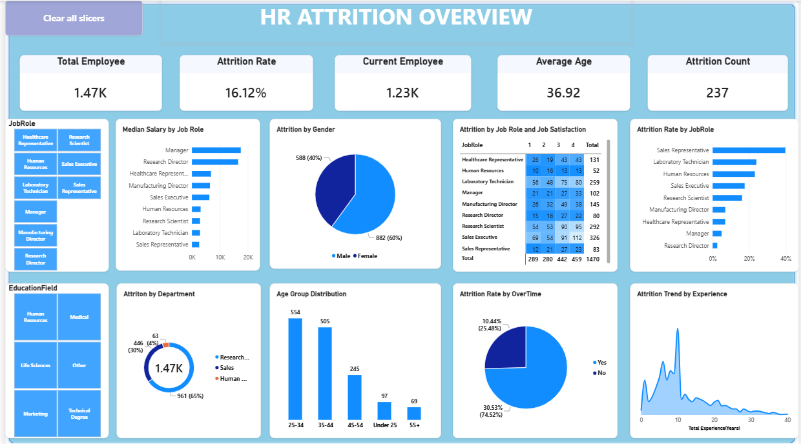

# HR Attrition Overview Dashboard — Power BI



## 📊 Project Overview

The **HR Attrition Overview Dashboard** is an interactive **Power BI HR analytics report** built to analyze employee attrition and identify workforce patterns that may require further HR investigation.

The report combines:

- **Power Query** for data validation and preparation
- **DAX measures** for business KPIs and analytical calculations
- Calculated columns for analysis such as **Age Group**
- Interactive slicers
- KPI cards
- Charts
- Matrix analysis
- Conditional formatting
- Dashboard-focused visual design

The main business question addressed by the report is:

> **Where is employee attrition occurring, and which workforce characteristics should HR investigate further?**

This page is designed as an **HR Attrition Overview** rather than a complete root-cause model. It highlights patterns and relationships that can guide deeper analysis.

---

# 🎯 Business Objectives

Employee attrition can affect recruitment requirements, workforce continuity, productivity, knowledge retention, and employee replacement costs.

This dashboard helps HR and management:

- Monitor the overall employee population.
- Measure the overall attrition rate.
- Understand the current workforce size.
- Identify the number of employees who have left.
- Compare attrition across job roles and departments.
- Compare attrition across gender groups.
- Examine attrition by overtime status.
- Understand workforce distribution by age group.
- Examine attrition patterns across experience levels.
- Compare salary levels across job roles.
- Examine the relationship between job satisfaction and attrition.
- Identify areas that may require deeper employee-level analysis.

The dashboard is intended to **support HR decision-making with data**, not to establish that any individual factor directly causes attrition.

---

# 🧹 Data Validation & Preparation — Power Query

Before building the visuals, the HR dataset was processed through **Power Query** in Power BI.

### Data preparation workflow

```text
Raw HR Dataset
      ↓
Power Query
      ↓
Data Type Validation
      ↓
Blank / Error Checks
      ↓
Category & Value Validation
      ↓
Clean Data Model
      ↓
DAX Measures & Calculated Columns
      ↓
Power BI Dashboard
```

### Validation performed

The data was reviewed for:

- Blank/null values
- Errors
- Incorrect data types
- Unexpected categorical values
- Consistency of Attrition values
- Consistency of Gender values
- Job Role values
- Department values
- Education Field values
- Job Satisfaction values
- Overtime values
- Numerical fields such as Age, Monthly Income, and experience-related fields

Power Query was used for **data preparation**, while DAX was used for **business calculations and analytical measures**.

---

# 🔎 Important Salary & Data-Meaning Validation

A key part of this project was validating the meaning of salary-related fields instead of assuming that every field containing the word "rate" represented actual monthly salary.

## Monthly Rate was not treated as Monthly Income

The **Monthly Rate** field was not interpreted as an employee's actual monthly salary.

For salary analysis, the report uses the dataset's **Monthly Income** field because it represents the employee income measure used for salary comparison.

## Hourly Rate and Weekly Rate were not converted into Monthly Salary

The dashboard does **not** create a monthly salary by simply converting:

```text
Hourly Rate → Monthly Salary
```

or

```text
Weekly Rate → Monthly Salary
```

without a documented business rule.

A conversion would require assumptions about working hours, working days, weeks per month, overtime, and other compensation rules.

Therefore:

> **Hourly Rate and Weekly Rate were not used to manufacture a monthly salary value.**

### Why this validation matters

This avoids introducing artificial salary values and prevents misleading salary comparisons.

It also demonstrates an important analytics principle:

> **A column name should not automatically be treated as a business definition. The meaning of the field must be validated before it is used for analysis.**

---

# 🧮 DAX Measures & Calculated Analysis

DAX was used to create reusable business measures so that KPI values and visuals respond dynamically to report filters and slicers.

## 1. Total Employee Count

Example DAX:

```DAX
Total Employee =
COUNTROWS('HR Data')
```

### Business purpose

Shows the total number of employees in the current filter context.

It provides the overall workforce population used to interpret other KPIs such as attrition count and attrition rate.

---

## 2. Attrition Count

Example DAX:

```DAX
Attrition Count =
CALCULATE(
    [Total Employee],
    'HR Data'[Attrition] = "Yes"
)
```

### Business purpose

Shows the number of employees who have left the organization.

This is useful for understanding the absolute volume of attrition, while the attrition rate provides the proportional view.

---

## 3. Attrition Rate

Example DAX:

```DAX
Attrition Rate =
DIVIDE(
    [Attrition Count],
    [Total Employee],
    0
)
```

Formatted as a percentage.

### Business purpose

Attrition rate is one of the most important HR KPIs because raw attrition counts can be misleading when comparing groups of different sizes.

For example, a job role with 20 employees leaving may appear to have more attrition than a role with 10 employees leaving, but the smaller role could have a much higher percentage of employees leaving.

Therefore:

> **Count shows volume; rate shows proportion.**

This dashboard uses attrition rate in several places to provide a more meaningful comparison.

---

## 4. Current Employee

Example DAX:

```DAX
Current Employee =
[Total Employee] - [Attrition Count]
```

### Business purpose

Shows the approximate number of employees who remain in the organization within the current filter context.

This KPI provides a quick view of the current workforce compared with the total employee population.

---

## 5. Average Age

Example DAX:

```DAX
Average Age =
AVERAGE('HR Data'[Age])
```

### Business purpose

Provides a high-level view of the average age of the employee population.

It helps HR understand the demographic profile of the workforce and provides context when examining age-group patterns.

---

## 6. Median Salary by Job Role

The dashboard uses **Median Monthly Income** for salary comparison.

Example DAX measure:

```DAX
Median Salary =
MEDIAN('HR Data'[Monthly Income])
```

### Why median instead of average?

Salary distributions can contain unusually high or low values.

The median represents the middle value of the salary distribution and is therefore useful for comparing typical salary levels across job roles without allowing extreme values to influence the result as strongly as an average.

### Business purpose

The visual compares salary levels across job roles and can help HR examine compensation differences between roles.

It should be interpreted as a **descriptive salary comparison**, not as proof that salary differences cause attrition.

---

# 📐 Age Group Calculated Column

A calculated column was added to group employees into meaningful age bands.

Example structure:

```DAX
Age Group =
SWITCH(
    TRUE(),
    'HR Data'[Age] < 25, "Under 25",
    'HR Data'[Age] <= 34, "25-34",
    'HR Data'[Age] <= 44, "35-44",
    'HR Data'[Age] <= 54, "45-54",
    "55+"
)
```

### Business purpose

Individual ages can be difficult to compare in a dashboard.

Age groups make it easier to identify how the workforce is distributed across different stages of the employee lifecycle and to compare those groups with other HR metrics.

---

# 📊 Dashboard KPIs

The top section contains five KPI cards.

| KPI | Definition | Business Purpose |
|---|---|---|
| **Total Employee** | Total employees in the current filter context | Establishes the workforce population |
| **Attrition Rate** | Attrition Count ÷ Total Employee | Measures the proportion of employees who left |
| **Current Employee** | Total Employee − Attrition Count | Shows the remaining workforce |
| **Average Age** | Average employee age | Provides workforce demographic context |
| **Attrition Count** | Employees where Attrition = Yes | Shows the absolute number of employees who left |

### Why both Attrition Count and Attrition Rate?

Using only attrition count can create misleading comparisons.

A larger department naturally has the potential to produce a larger count.

The attrition rate normalizes the result against the size of the employee population.

Therefore the two KPIs answer different questions:

- **Attrition Count:** How many employees left?
- **Attrition Rate:** What percentage of the employee population left?

---

# 📈 Dashboard Visuals & Business Purpose

## 1. Median Salary by Job Role

**Visual:** Horizontal bar chart

### What it shows

Compares the median salary/income across different job roles.

### Business purpose

Helps HR understand compensation differences between roles and provides salary context when reviewing workforce patterns.

It can be used as a starting point for questions such as:

- Which roles have higher typical income?
- How does compensation differ across job families?
- Do high- or low-income roles show different attrition patterns?

This visual describes salary differences; it does not establish causation.

---

## 2. Attrition by Gender

**Visual:** Pie chart

### What it shows

Displays the distribution of employees who have left by gender.

### Business purpose

Provides a demographic view of attrition.

It helps HR identify whether attrition volume is concentrated differently across gender groups and whether additional rate-based analysis is needed.

Because group sizes can differ, the chart should be interpreted together with the overall employee population and, where appropriate, gender-specific attrition rates.

---

## 3. Attrition by Job Role & Job Satisfaction

**Visual:** Matrix with conditional formatting

### What it shows

The matrix crosses:

- **Job Role**
- **Job Satisfaction**

and displays attrition-related values across the satisfaction categories.

### Business purpose

This is one of the dashboard's more detailed diagnostic visuals.

It helps HR examine whether attrition appears differently across combinations of:

**Job Role + Job Satisfaction**

For example, HR can investigate whether particular job roles contain higher attrition values in specific satisfaction categories.

The matrix is intended to identify patterns for further investigation rather than prove that job satisfaction alone causes attrition.

---

## 4. Attrition Rate by Job Role

**Visual:** Horizontal bar chart

### What it shows

Compares attrition rate across job roles.

### Business purpose

This visual is particularly useful because it normalizes attrition by the size of each job-role population.

It allows HR to investigate:

- Which roles have higher attrition rates?
- Which roles have lower attrition rates?
- Where should employee-level analysis be performed next?

Using a rate rather than only a count reduces the risk of interpreting larger job populations as automatically having worse attrition.

---

## 5. Attrition by Department

**Visual:** Donut chart

### What it shows

Shows the employee population/attrition distribution across departments.

### Business purpose

Provides a department-level view of workforce composition and attrition.

It helps HR understand where the organization's attrition volume is concentrated and which departments may require deeper analysis.

Department size should be considered when interpreting the visual; a larger department can naturally have a larger count.

---

## 6. Age Group Distribution

**Visual:** Column chart

### What it shows

Displays employee counts across age groups:

- Under 25
- 25–34
- 35–44
- 45–54
- 55+

### Business purpose

Shows the demographic structure of the workforce.

This can support questions around:

- Workforce age distribution
- Early-career vs experienced employees
- Workforce planning
- Succession planning
- Age-related attrition investigation

The visual describes the workforce composition rather than indicating that age itself causes attrition.

---

## 7. Attrition Rate by Overtime

**Visual:** Pie chart

### What it shows

Compares attrition rate for employees based on overtime status.

### Business purpose

Allows HR to investigate whether attrition rates differ between employees who work overtime and those who do not.

This can support further investigation into workload, work-life balance, and employee retention.

The relationship shown in the dashboard should be interpreted as an association, not as proof that overtime directly causes employees to leave.

---

## 8. Attrition Trend by Experience

**Visual:** Area chart

### What it shows

Displays the pattern of attrition across total work experience.

### Business purpose

Helps HR identify experience levels where attrition may be more concentrated.

This can support questions such as:

- Is attrition concentrated among early-career employees?
- Does attrition change as experience increases?
- Are there particular experience ranges that require retention analysis?

Experience patterns can help HR determine where additional employee-level investigation may be useful.

---

# 🎛️ Interactive Filters

The dashboard includes interactive filtering through Power BI slicers.

## Job Role

Allows the user to focus the dashboard on a specific job role.

This makes it possible to compare:

- Attrition rate
- Attrition count
- Salary
- Age distribution
- Satisfaction
- Other dashboard metrics

within a selected role.

## Education Field

Allows the user to analyze the employee population by education field.

This provides additional workforce segmentation and helps HR examine whether workforce characteristics differ across educational backgrounds.

## Clear All Slicers

The **Clear All Slicers** button provides a quick way to return the dashboard to its default overall view after applying filters.

---

# 🧠 How to Read the Dashboard

A useful analytical workflow is:

```text
1. Start with Total Employee
          ↓
2. Check Attrition Rate
          ↓
3. Compare Attrition Count
          ↓
4. Identify Job Roles / Departments with notable attrition
          ↓
5. Examine Overtime and Gender patterns
          ↓
6. Examine Job Satisfaction by Job Role
          ↓
7. Review Age and Experience patterns
          ↓
8. Compare Salary by Job Role
          ↓
9. Apply slicers for deeper investigation
```

This approach moves from **overall workforce measurement → segmentation → deeper investigation**.

---

# 💼 Business Questions Supported by the Dashboard

The dashboard can help answer questions such as:

### Workforce

- How many employees are in the dataset?
- How many employees currently remain?
- What is the overall attrition rate?
- What is the average age of the workforce?

### Attrition

- How many employees have left?
- Which job roles show different attrition rates?
- How is attrition distributed across departments?
- How does attrition differ across gender groups?

### Employee Experience

- How does attrition appear across job satisfaction levels?
- How does attrition differ between overtime groups?
- At which experience levels does attrition appear concentrated?

### Compensation

- How does median salary differ by job role?
- Which roles have higher or lower typical salary levels?
- Can salary differences provide useful context for further attrition analysis?

### Workforce Demographics

- Which age groups contain the largest employee populations?
- How does workforce composition differ across education fields?
- What additional analysis should HR perform for specific employee segments?

---

# 🛠️ Tools & Technologies

- **Microsoft Power BI**
- **Power Query**
- **DAX**
- Data transformation and validation
- Calculated columns
- DAX measures
- KPI cards
- Pie charts
- Donut charts
- Bar charts
- Column charts
- Area charts
- Matrix with conditional formatting
- Interactive slicers
- Dashboard navigation and interaction design

---

# 📌 Key Analytical Principles Used

### 1. Prefer rates when comparing groups

Counts show volume, but rates provide better comparison across groups of different sizes.

### 2. Validate field meaning before using it

Fields such as Monthly Rate, Hourly Rate, and Weekly Rate were not automatically interpreted as monthly salary.

### 3. Separate data preparation from analysis

Power Query was used for cleaning and validation, while DAX was used for analytical calculations.

### 4. Use measures for dynamic KPIs

DAX measures allow KPI values to respond to slicers and filter context.

### 5. Avoid assuming correlation means causation

A visual relationship between two HR variables does not by itself establish that one variable causes attrition.

---

# ⚠️ Limitations & Assumptions

- The dashboard describes patterns in the available HR dataset.
- Attrition relationships shown in visuals should not automatically be interpreted as causal relationships.
- Salary analysis uses **Monthly Income** rather than treating Monthly Rate, Hourly Rate, or Weekly Rate as monthly salary.
- Group comparisons should consider the underlying population size.
- Attrition count and attrition rate answer different business questions and should be interpreted together.
- Further analysis may be required before making HR policy or employee-retention decisions.

---

# 📁 Project Files

```text
HR-Attrition-Dashboard/
│
├── Company-Attrition-Dashboard.png
├── Company-Attrition-Report.pbix
└── README.md
```

### Files Included

| File | Purpose |
|---|---|
| **Company-Attrition-Report.pbix** | Complete Power BI report containing the data model, Power Query transformations, DAX measures, calculated columns, slicers, visuals, and dashboard design. |
| **Company-Attrition-Dashboard.png** | Exported dashboard preview image for quick viewing without opening Power BI. |
| **README.md** | Project documentation covering the data preparation, calculations, dashboard design, business purpose, and analytical approach. |

> **Note:** The `.pbix` file is the main interactive Power BI report. The `.png` file provides a static preview of the completed dashboard.

---

# 🚀 Project Outcome

This project demonstrates an end-to-end Power BI workflow:

```text
HR Dataset
    ↓
Power Query Validation & Transformation
    ↓
Data Model
    ↓
Calculated Columns
    ↓
DAX Measures
    ↓
KPI Development
    ↓
Interactive Visualizations
    ↓
HR Attrition Overview Dashboard
```

The final dashboard converts raw HR data into an interactive analytical report that allows users to move from **overall attrition measurement to segmented workforce analysis**.

The project includes the complete **`Company-Attrition-Report.pbix` Power BI report** and a **`Company-Attrition-Dashboard.png` dashboard preview**.

---

## 👤 Project Focus

**Domain:** Human Resources / People Analytics  
**Tool:** Microsoft Power BI  
**Primary Techniques:** Power Query, DAX, Data Validation, Calculated Columns, Measures, Interactive Dashboard Design  
**Dashboard Type:** HR Attrition & Workforce Analysis
